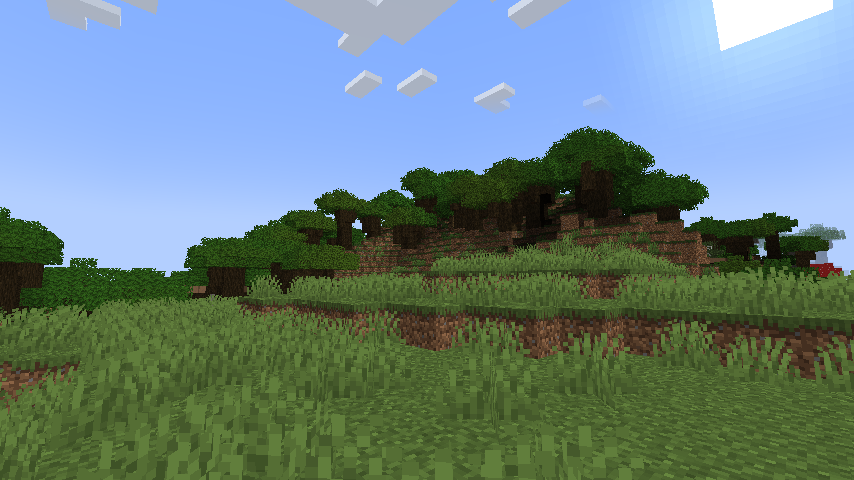

## Minecraft on Replit

As the title says, Run a minercraft server on Replit.com in a few minutes.

[](https://repl.it/github/SrEvelio/Minecraft-Replit)
### How to enter the server

To be able to enter the server you will need a Ngrok key (It is totally free and you can obtain one at its [official site](https://ngrok.com/)).

Once you have your key simply put it in the Secrets section, after that simply choose the software and version of your choice in config.json. The server's ip and port will be displayed in the console as soon as you press start.

##

### Softwares
In this new version, I thought, why not put more server types and versions, so now you can choose between [Purpur](https://purpurmc.org/) (1.20.4 - 1.14.1), [Paper](https://papermc.io/) (1.20.4 - 1.8.8), [Sponge](https://spongepowered.org/) (1.8.9 - 1.12.2) and Vanilla (1.20.4 - 1.7.10).

Now you are wondering how to select the type and version, well it is simple, basically edit the config.json file and in each value simply put the one of your preference, by default it will come with Vanilla 1.8.9 (I think it is the version that works best).

```js
{
    "software": "paper", // Purpur, Paper, Vanilla, Sponge
    "version": "1.8.8",
    "ngrokregion": "us" // us, eu, au, ap, sa, jp, in
}
```
##

### Notes
To try to optimize the project more we started to use replit's own java but this led to the fact that versions higher than 1.16.5 cannot be started, so to be able to start higher versions you must use a different java, so to start them simply edit the .replit file to start the start17.sh file instead of start.sh.

By the way, because replit is not designed to run minecraft servers (although it is possible) these may have a questionable performance so it will not always keep 20 Ticks per second or even reach it, so this is more for curiosity and to know the limits of replit.

##

### Changelog
<details>
  <summary>Version 2.0.1 - 2024-01-27</summary>

  - Code enhancements and bug fixes
  - EULA is now automatically accepted when installing software
  - Server softwares are now downloaded from their respective APIs
  - Added javaArgs.txt to modify java parameters
  - Now config.json is located inside the "config" folder next to javaArgs.txt

</details>

##

### Star History

<a href="https://star-history.com/#SrEvelio/Minecraft-Replit&Date">
  <picture>
    <source media="(prefers-color-scheme: dark)" srcset="https://api.star-history.com/svg?repos=SrEvelio/Minecraft-Replit&type=Date&theme=dark" />
    <source media="(prefers-color-scheme: light)" srcset="https://api.star-history.com/svg?repos=SrEvelio/Minecraft-Replit&type=Date" />
    
  </picture>
</a>


##

### ScreenShots




